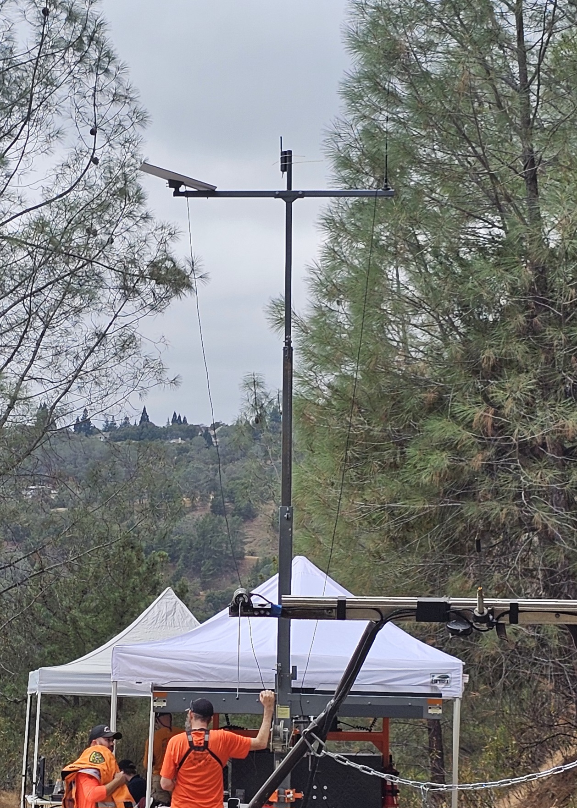

# RID2Caltopo (Remote ID to Caltopo):  Live Drone Tracking for SAR

This android application monitors Bluetooth and WiFi networks for [ASTM F3411](https://store.astm.org/f3411-22a.html) - 
compatible Remote ID location updates and records the updates as a sequence of track waypoints 
that are compatible with [Caltopo](https://www.caltopo.com)'s geo-json file format.   

Additionally, if a you have configured caltopo teams credentials properly and your mapid points 
to an existing map that the credentials have write/update permissions for, the app can plot real-
time LiveTrack updates into the map.

This functionality closes the previously open loop between search assignments and actual drone 
coverage.  The real-time updates allow an air-boss or supplemental Visual Observers to keep 
tabs on all airborne assets.

The [Caltopo](https://www.caltopo.com) platform is the preferred search management platform for many SAR agencies, 
including the Nevada County Sheriff's Search And Rescue organization from which this project 
originates.  This project is very thankful to the developers of Caltopo for supporting their
Teams API for developers.   We are also thankful for the network sniffing and decoding code
developed by the [OpenDroneId](https://github.com/opendroneid/receiver_android) project.

Android phones and tablets have limited sensitivity to the Remote ID signalling.   To make 
this tool work for SAR applications, where drone search segments can span many thousands of 
feet, it is recommended that you pair the app with a [Dronescout Bridge](https://www.gearfocus.com/products/new-bluemark-ds100-dronescout-retail-bridge-faa-remote-id-re-rEBYx). Just power-up 
the bridge and raise it up a fair bit to optimize coverage:

Please note: The user of this application must always visually verify that the received Remote ID
signal corresponds to an actual drone seen flying in the air, at the position the signal claims it 
to be.

This app's settings menu option allows the user to quickly change options that are likely to vary 
from one invocation to the next.  Support for more involved or sensitive configuration information 
is provided by the app's "load config file" menu option, which currently supports two .json 
configuration file formats:

## ridmap.json:
Use the ridmap configuration file format to map remoteIDs to more friendly track labels:
<blockquote><code>
{
    "type" : "ct_ridmap",
    "file_version" : "1.0",
    "editor" : "admin@kjt.us",
    "updated" : "Wed Sep 17 12:42:41 PDT 2025",
    "map" : [
        {
            "remoteId" : "1581F6Z9C24BH0036EJL",
            "mappedId" : "1SAR7mm4p",
            "org" : "NCSSAR",
            "owner" : "NCSSAR",
            "model" : "Mavic Mini 4 Pro"
	    },
        {
            "remoteId" : "1581F67QE239L00A00DE",
            "mappedId" : "1SAR7m3p",
            "org" : "NCSSAR",
            "owner" : "NCSSAR",
            "model" : "Mavic 3 Pro"
        },
    ]
}
</code></blockquote>
The remoteId is the actual identifier broadcast by the drone.   The default value of the mappedId 
is the same as the remoteId, but can be changed in the app's user interface.  Try to pick values
for mappedId that identify the Remote Pilot In Command (RPIC), the type of drone, and the payload
capabilities.  The other fields are optional and may be omitted or left blank in this version of
the app.

## credentials.json:
Use the credentials configuration file format to specify your team's map information and 
[Caltopo Credentials](https://training.caltopo.com/all_users/team-accounts/teamapi#keysids):

<blockquote><code>
{
    "type" : "ct_credentials",
    "file_version" : "1.0",
    "editor" : "admin@kjt.us",
    "updated" : "Fri Sep 19 08:07:01 PDT 2025",
    "team_id" : "team_id value",
    "credential_id" : "credential id value",
    "credential_secret" : "this is where you enter your credential secret",
    "map_id" : "AH2JKLM",
    "use_direct_flag" : true,
    "group_id" : "NCSSAR",
    "track_folder" : "DroneTracks"
}
</code></blockquote>
The **team_id**, **credential_id**, and **credential_secret** tuple comprise the Caltopo Teams
APIs credentials.  These are the only required fields for this file.    The **map_id**, 
**group_id**, and **use_direct_flag** may all be configured separately in the apps Settings 
menu.  The **track_folder** is the name of the folder to create in the map to receive drone tracks.

## Support for multiple apps writing to same map at the same time:
Each DroneScout Bridge has a limited detection range.  Many factors contribute to the maximum
detection range, including location and height of the bridge, terrain, foliage, and weather 
conditions.   Our first major test of the bridge revealed that line of sight is the best 
determinate for the possible coverage, so we added support for multiple DroneScout Bridge + 
RID2Caltopo pairings, which we'll call "R2C Zones" or more simply "R2C" instances going 
forward.

Each R2C instance needs to have network connectivity to write to the map and to connect with it's 
peers.  Networks can be cellular data or wireless.  In the Sierras, we frequently end up setting up 
battery powered Starlink Minis if we can't locate our R2C instance high enough to get cell
coverage.

You’ll most likely need to run ZeroTier on all your devices if they aren’t already connected to 
the same subnet. ZeroTier provides the ability for networked devices to rendezvous across network
boundary's.  To do this, log in to [ZeroTier.com](https://www.ZeroTier.com) and create a 
free account, then create a network and copy the 16 digit network ID. Then download the free 
ZeroTier app from the PlayStore and connect to the network ID copied above.  If you mark that 
ZeroTier network as a 'public' network, then a bad actor could guess or otherwise learn about 
your network ID and then have direct network access to your devices, so consider carefully.  The
default is to configure a private network, where you'll need to use the web interface to approve
each new device that connects.   After all that, you just need to make sure that the ZeroTier app 
is up and running and connected to your ZeroTier network _prior_ to starting RID2Caltopo.  

When RID2Caltopo connects to a map, it creates a marker at the device's current location in the 
"track_folder" specified above.  The marker contains a private field listing all the network 
addresses of the corresponding device.  The app then looks for peer Markers in the same folder and 
extracts their addresses from the marker and attempts to connect to those peers via a secure 
websockets connection.  Once peers are connected, they establish 'ownership' of drones when they 
launch.  In cases where R2C zones have overlap in their detection coverage, the proximity of the
drone's location to each R2C instance will be the primary factor deciding which instance becomes
the owner.  

After receiving ownership of a drone, the app will write all subsequent waypoints into the Caltopo 
map.  R2C peers that detect any waypoints associated with a drone owned by a peer will forward 
copies of those waypoints to the owning R2C instance.  The owning R2C instance then compares the 
peer provided waypoints to those it's detected and adds any missing waypoints to the drone's track.   
This mechanism extends the detection range of a drone to multiple R2C Zones.

## R2C Site selection
Your team's drone pilots (RPICs) and search planning coordinators should ideally work together to 
identify the characteristics of reasonable boundaries for drone search segments as well as 
potential sites for each R2C instance.  I recommend doing this first in training sessions, where 
you have the gift of extra time to discuss the tradeoffs involved.   The best search segment 
boundaries will all lie within the range of the Visual Observers (VOs) at minimum.   If you have 
the required BVLOS (Beyond Visual Line Of Sight) waiver, the other consideration is the effective 
range of your controllers telemetry while staying within the required maximum AGL altitude.  
Fortunately, factors affecting controller telemetry are the same that affect the detection range 
of the DroneScout bridge (both operate on the same frequencies).   

Try to establish the site location for the Bridge and R2C as high as possible.  Amazon has [tall 
tripods](https://www.amazon.com/s?k=tall+tripod) that you can use to place the bridge and a 
corresponding power bank 15' or more above the ground.  If your tripod is tall enough, you may
consider placing the cell phone running RID2Caltopo on the same tripod.  It isn't necessary to
place the device running RID2Caltopo right next to the bridge, but by placing the entire setup at 
higher locations, you will also tend to improve your chance of getting cell coverage.

## How to build
To build the application, use Android Studio.
Import the project (File -> New -> Import Project, or just Open on newer versions of Android Studio) 
and point to the root folder. Then Build -> Make Project.

## Supported interfaces and protocols
Bluetooth 4 (legacy bluetooth), Bluetooth 5 (long range/coded phy), WiFi Beacon, and WiFi NaN are all 
supported by the app. While bluetooth 4 seems to be universally supported, some phones/tablets may not 
support one or more of the other capabilities.

## Privacy Policy
This app doesn't collect or disseminate any information except in the service of connecting to 
a caltopo map.  For more specifics, please see the corresponding [PrivacyPolicy.md](Privacy Policy)
document.

## High level SW Architecture
A KenDraw(tm) view of the class structure can be seen in the figure below:

