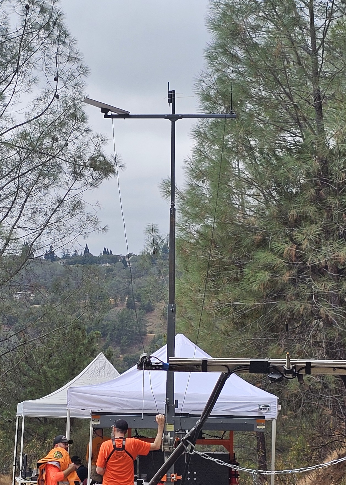

# RID2Caltopo (Remote ID to Caltopo):  Live Drone Tracking for SAR

This android application monitors Bluetooth and WiFi networks for [ASTM F3411](https://store.astm.org/f3411-22a.html) - 
compatible Remote ID location updates and records the updates as a sequence of track waypoints 
that are compatible with [Caltopo](https://www.caltopo.com)'s geo-json file format.   

Additionally, if you have configured caltopo teams credentials properly and your mapid points 
to an existing map that the credentials have write/update permissions for, the app can plot near
real-time* LiveTrack updates into the map.

All drones in service of a SAR organization should be required to emit Remote ID signaling, 
enabling this drone and manufacturer-agnostic app to close the previously open loop between 
search assignments and actual drone coverage.  Together with Caltopo's "Aircraft" layer, the
~real-time updates from this app allow an air-boss or supplemental Visual Observers to keep 
track of all airborne assets.

The [CalTopo](https://www.caltopo.com) platform is a search-management platform used by many SAR agencies.
RID2Caltopo is an independent project and is not affiliated with or endorsed by CalTopo. It uses
the CalTopo Teams API. The RID2Caltopo developer thanks the CalTopo team for its excellent product
and support of the Teams API. We are also thankful
for the network sniffing and decoding code developed by the [OpenDroneId](https://github.com/opendroneid/receiver-android) project.

Android phones and tablets have limited sensitivity to the Remote ID signalling.  They should
be able to work fine when the drone is within a few dozen feet of the device.  To make 
this tool work for SAR applications, where drone search segments can span many thousands of 
feet, it is recommended that you pair the app with a [Dronescout Bridge](https://www.gearfocus.com/products/new-bluemark-ds100-dronescout-retail-bridge-faa-remote-id-re-rEBYx). Just power-up 
the bridge and raise it up a fair bit to optimize coverage:

New for 2026: BlueMark Innovations has released a [tri-band bridge](https://dronescout.co/product/dronescout-bridge-triple-band-ds110-retail-remoteid-receiver-for-ios-android-and-drone/?v=0b3b97fa6688)
that enables capturing 5Ghz WiFi and WiNan signalling commonly used with Skydio drones.  My unit arrived in California in less than 
a week from the Netherlands.
  
Please note: The user of this application must always visually verify that the received Remote ID
signal corresponds to an actual drone seen flying in the air, at the position the signal claims it 
to be.

This app's settings menu option allows the user to quickly change options that are likely to vary 
from one invocation to the next.  Support for more involved or sensitive configuration information 
is provided by the app's "load config file" menu option, which currently supports three .json 
configuration file formats:

## ridmap.json:
Use the ridmap configuration file format to map remoteIDs to more friendly track labels:

<blockquote><code>
{
    "type" : "ct_ridmap",
    "file_version" : "1.0",
    "editor" : "admin@kjt.us",
    "updated" : "Wed Sep 17 12:42:41 PDT 2025",
    "map" : [
        {
            "remoteId" : "1581F6Z9C24BH0036EJL",
            "mappedId" : "1SAR7min4p",
            "org" : "mySAR",
            "owner" : "mySAR",
            "model" : "Mini 4 Pro"
	    },
        {
            "remoteId" : "1581F67QE239L00A00DE",
            "mappedId" : "1SAR7mvc3p",
            "org" : "mySAR",
            "owner" : "mySAR",
            "model" : "Mavic 3 Pro"
        },
    ]
}
</code></blockquote>

The remoteId is the actual identifier broadcast by the drone.   The default value of the mappedId 
is the same as the remoteId, but can be changed in the .json file or the app's user interface.  
Try to pick values for mappedId that identify the Remote Pilot In Command (RPIC), the type of drone, 
and the payload capabilities of the drone.  The other fields are optional and may be omitted or 
left blank in the current version of the app.

### Mapped ID Rules Checking introduced in 1.0.7rc1:
Changes to the mapped ID must include the pilot's Callsign of the form [0-9]?[A-Z]+[0-9]+ 
(for regex junkies) or more simply put:
  1SAR7
  SAR7
  SAR007
  1P16

You can also tack on a brief mnemonic for the drone type and payload. If omitted, then
this app will attempt to convert the model to mnemonic form by removing spaces and vowels.

## credentials.json:
Use the credentials configuration file format to specify your team's map information and 
[Caltopo Credentials](https://training.caltopo.com/all_users/team-accounts/teamapi#keysids) along with [tracker](https://github.com/kjtsar/r2c-tracker)
website if your team is using that tool to keep track of flights:

<blockquote><code>
{
    "type" : "ct_credentials",
    "file_version" : "1.0",
    "editor" : "admin@kjt.us",
    "updated" : "Fri Sep 19 08:07:01 PDT 2025",
    "team_id" : "team_id value",
    "credential_id" : "credential id value",
    "credential_secret" : "this is where you enter your credential secret",
    "map_id" : "AH2JKLM",
    "use_direct_flag" : true,
    "group_id" : "mySAR",
    "track_folder" : "DroneTracks",
    "tracker_url_prefix" : "https://tracker.kjt.us",
    "tracker_api_key" : "SecretTokenToAuthenticateSubmission"
}
</code></blockquote>

The tracker settings are optional. If `tracker_url_prefix` and `tracker_api_key`
are configured, RID2Caltopo will use tracker-backed multi-zone coordination.
If they are omitted, the app falls back to MQTT-based peer coordination. The
legacy `tracker_url_pfx` key is still accepted for backward compatibility.

The _team_id_, _credential_id_, and _credential_secret_ tuple comprise the
CalTopo Teams API credential. Map selection remains in each app.

Managed organizations distribute an `R2C2` configuration containing team
settings, RID mappings, and a signed r2c-tracker enrollment locator. Android or
iOS redeems that locator for a unique, revocable device credential; an issued
device secret is never copied into the organization bundle. The enrollment
campaign must allow enough redemptions for the receiving devices. R2C1
organization tokens are not accepted.

## ct_mutual_aid_credentials
If you can enlist the help of your Caltopo Teams Admin, have them create a subteam account 
that only has update permissions for a single team folder.  We called ours DroneMa.  When
your admin finishes, they will provide you with a team_id, credential_id, and credential_secret
tuple for that account.  Enter those values as follows into your ma_config.json file:

<blockquote><code>
{
  "type": "ct_mutual_aid_credentials",
  "file_version": "1.0",
  "editor" = "Admin <admin@nasar.org>",
  "updated" = "Sat Apr 11 15:04:41 PDT 2025",
  "org_name" : "NASAR_MAI",    
  "team_id": "ma team id",
  "credential_id": "ma credential id",
  "credential_secret": "ma credential secret",
  "domain_and_port": "caltopo.com",
  "source_label": "NASAR Mutual Aid",
  "target_folder_hint": "DroneMA"
}
</code></blockquote>

When loaded into RID2Caltopo, this permits your app to publish a Mutual Aid package for visiting
RID2Caltopo teams to use during a mutual aid search(Ref Menu->Export MA Package).  Just create a 
bookmark in your team's DroneMA folder that points to the Mutual Aid Incident Map and visiting 
teams will be able to connect to it and publish their drone tracks.   If the publishing RID2Caltopo
map already has all the relevant map tiles downloaded they will be pushed out in the MA Package,
allowing the receiving app to hit the ground running.

## Support for multiple apps writing to same map at the same time:
Each DroneScout Bridge has a limited detection range.  Many factors contribute to the maximum
detection range, including location and height of the bridge, terrain, foliage, and weather 
conditions.   Our first major test of an earlier experimental release of RID2Caltopo and the 
bridge revealed that line of sight is probably the best determinate for coverage, so we added 
support for multiple DroneScout Bridge + RID2Caltopo pairings, which we'll call "R2C Zones" or 
more simply "R2C" instances going forward.

Recent field testing with a DroneScout Bridge and a small RID module showed that the bridge can
still be detected at a few hundred feet in favorable conditions, but reception is not continuous
enough at that distance to treat it as an operator-trustworthy link.  As a conservative operating
guideline, keep the tablet or phone running RID2Caltopo within about 10 meters of its paired
DroneScout Bridge.  If multiple DroneScout Bridges are deployed for the same incident, separate
the bridges by at least 200 meters when practical.  Placing several bridges close together can make
local Bluetooth congestion worse by causing multiple strong bridge transmitters to rebroadcast
near the same tablet instead of improving coverage.

Each R2C instance needs to have network connectivity to write to the map and to connect with it's 
peers.  Networks can be cellular data or wireless.  In the Sierras, we may end up setting up 
battery powered Starlink Minis if we can't locate our R2C instance high enough to get cell
coverage.

When RID2Caltopo connects to a map, it creates a marker at the device's current location in the 
"track_folder" specified above.

If `tracker_api_key` and `tracker_url_prefix` are configured, RID2Caltopo will prefer
tracker-backed peer coordination. Each R2C zone opens an outbound connection to the
organization's `r2c-tracker` service, reports its presence and approximate location, and
submits first-sighting and waypoint candidate updates for each observed Remote ID. The
tracker service acts as the rendezvous point and ownership arbiter: it assigns one zone as
the owner for each drone stream and relays candidate sightings to that owner. The owner is
then responsible for suppressing duplicates, enforcing strictly increasing waypoint
timestamps, and writing the accepted track into the CalTopo map.

If tracker coordination is not configured, RID2Caltopo falls back to MQTT-based peer
coordination. That path uses the map-scoped MQTT topic space to negotiate ownership and
share peer state. If neither tracker nor MQTT coordination is available, or if peer
coordination is explicitly disabled in the app's testing tools, each R2C zone writes its
own track independently and duplicate tracks may appear in CalTopo.

## R2C Site selection
Your team's Remote Pilot In Command 
([RPIC](https://www.ecfr.gov/current/title-14/chapter-I/subchapter-F/part-91#91.3)) 
and search planning coordinators should ideally work together to identify the characteristics of 
reasonable boundaries for drone search segments as well as potential sites for each R2C instance.
It's best if you can do this first in training sessions, where you have the gift of time to 
discuss the tradeoffs involved.   The best search segment boundaries will generally all lie within 
the range of the Visual Observers (VOs) at minimum.   If you have the necessary BVLOS (Beyond Visual 
Line Of Sight) waiver, the other consideration is the effective range of your controllers telemetry 
while staying within the required maximum AGL altitude.   Fortunately, factors affecting controller 
telemetry are the same that affect the detection range of the DroneScout bridge (both operate on the 
same frequencies).   

Try to establish the site location for the Bridge and R2C as high as possible.  Amazon has [tall 
tripods](https://www.amazon.com/s?k=tall+tripod) that you can use to elevate the bridge and a 
corresponding power bank 15' or more above the ground.  If your tripod is tall enough, you might
consider placing the cell phone running RID2Caltopo on the same tripod.  It isn't necessary to
place the device running RID2Caltopo right next to the bridge, but keep it within about 10 meters of the
bridge when possible.  By placing the entire setup at higher locations, you can improve your chance
of getting cell coverage.

## How to build
To build the application, use Android Studio.
Import the project (File -> New -> Import Project, or just Open on newer versions of Android Studio) 
and point to the root folder. Then Build -> Make Project.

## Detector documentation

RID2Caltopo includes an Anomaly Detector that can help searchers identify
regions of interest in infrared and visible-light drone video. For a
non-technical introduction to its infrared, color, target-color, motion, and
saliency capabilities, see [Anomaly Detector: An Introduction for SAR Users](docs/Anomaly_Detector_Introduction_for_SAR.md).

For technical infrared detector design notes, see
[IR Anomaly Detector](docs/IR_Anomaly_Detector.md).

For the current visible-light detector architecture, including Color Outlier,
Target Colors, realtime scheduling, and qualification, see
[Color Anomaly Detector](docs/Color_Anomaly_Detector.md).

## MediaMTX
The latest version of this app bundles a version of the MediaMTX 1.16.2 server that has been tailored
to the sensitivities of various DJI and Autel drone controllers and to support low-latency playback.
RID2Caltopo stores only the source patches and reproducible build instructions under
[`third_party/mediamtx`](third_party/mediamtx); generated executables are intentionally excluded from Git.
MediaMTX remains licensed under its MIT license; see
[Third-Party Software Notices](THIRD_PARTY_NOTICES.md).

## Supported interfaces and protocols
Bluetooth 4 (legacy bluetooth), Bluetooth 5 (long range/coded phy), WiFi Beacon, and WiFi NaN are all 
supported by the app. While bluetooth 4 seems to be universally supported, some phones/tablets may not 
support one or more of the other capabilities.

## Privacy Policy
This app doesn't collect or disseminate any information except in the service of connecting to 
and updating a caltopo map.  For more specifics, please see the corresponding 
[Privacy Policy](PrivacyPolicy.md) document.

## License

RID2Caltopo's original source code and documentation are licensed under the
[Apache License 2.0](LICENSE). Third-party components retain their respective
licenses; see [Third-Party Software Notices](THIRD_PARTY_NOTICES.md) and
[NOTICE](NOTICE).

RID2Caltopo is an operational aid rather than a certified aviation, navigation,
or life-safety system. Review the [operational disclaimer](DISCLAIMER.md) before
using it in the field. Contributions are welcome under the terms described in
[CONTRIBUTING.md](CONTRIBUTING.md).
